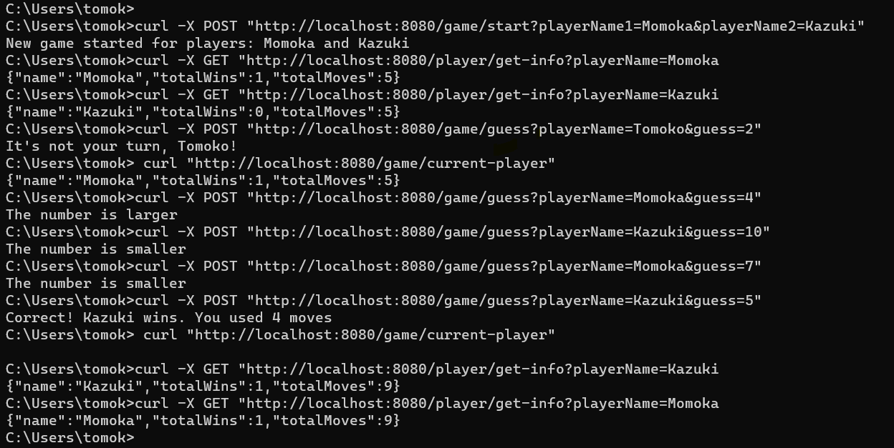
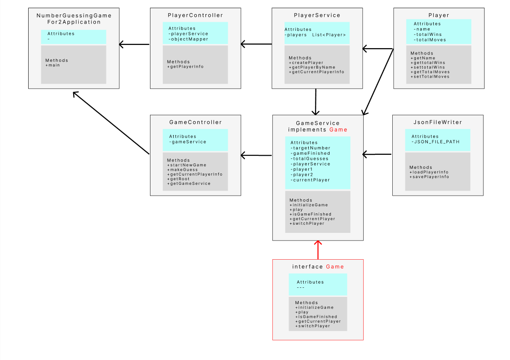

# Number Guessing Game

## Introduction
The Number Guessing Game is an engaging two-player game where participants take turns guessing a randomly selected number between 1 and 10. It's a fun way to challenge your guessing skills and enjoy some friendly competition with a friend.

## Game Rules

-Player 1 and Player 2 take turns guessing a number.
-Players enter an integer between 1 and 10.
-The player who correctly guesses the number wins, and the game ends.

## How to Play

1. **Starting the Game:**
 curl -X POST "http://localhost:8080/game/start?playerName1=Momoka&playerName2=Kazuki"

2. **Player Names:**
   - The game will prompt you to enter the names of Player 1 and Player 2.
   - Type the names for both players.

3. **Taking Turns:**
 curl -X POST "http://localhost:8080/game/guess?playerName=Momoka&guess=4"
 curl "http://localhost:8080/game/current-player"
   - The game will randomly select a target number between 1 and 10.
   - Player 1 takes the first turn. 
   - Player 1 enters their guess as an integer and presses Enter.
   - The game will provide feedback, such as "The number is larger" or "The number is smaller.
   - Player 2 follows the same process, taking turns with Player 1.

4. **Winning the Game:**
   - The game continues until one of the players correctly guesses the target number.
   - The game announces the winner and displays the number of moves it took to win.

5. **Reviewing Game Data:**
 curl -X GET "http://localhost:8080/player/get-info?playerName=Kazuki
   - The game provides an option to view the details of the previous game.
   - Simply type "review" or a similar command as prompted by the game.

6. **Enjoy the Game!**

## Demo

## Design for the application objects

 
## Languages and Tools Used
Java
Spring Framework

## Author
Tomoko Takami 
OAMK DIN22SP

 
